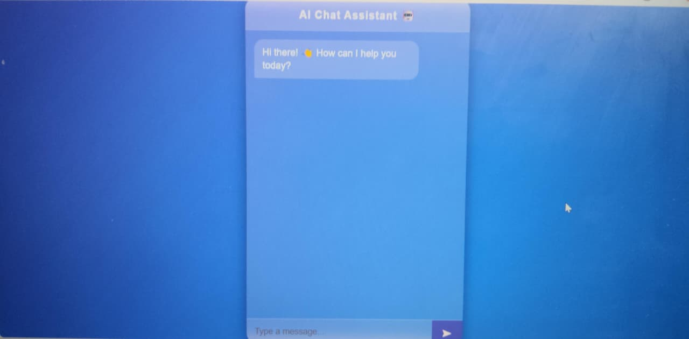

# 🤖 AI Chat Assistant

A simple and interactive web-based AI Chat Assistant built using HTML, CSS, and JavaScript.

## 📌 About the Project

AI Chat Assistant is a lightweight chatbot web application with a modern and user-friendly chat interface.

Users can send messages and receive automated responses from the chatbot. The application can also provide the current time and date, respond to greetings, and handle basic conversations.

## ✨ Features

- 💬 Interactive chat interface
- 🤖 Automated chatbot responses
- 👋 Greeting responses
- 🕐 Current time response
- 📅 Current date response
- ❓ Help response
- 👋 Goodbye response
- ⌨️ Enter key support
- 🎨 Modern glassmorphism design
- ✨ Smooth message animations
- 📱 Responsive user interface

## 🛠️ Technologies Used

- HTML5
- CSS3
- JavaScript
- GitHub

## 📂 Project Structure

```text
project-1/
│
├── index.html
├── style.css
├── script.js
├── README.md
│
└── assets/
    ├── screenshot.png
    └── demo.gif

🚀 How to Run
Download or clone this repository.
Open the project folder.
Open index.html in a web browser.
Start chatting with the AI Chat Assistant.

💬 Sample Queries
Try asking:
Hi
Hello
What is your name?
What is the time?
What is the date?
Help
Bye

🎥 Demo Video
▶️ Watch Demo Video
 https://anu200620.github.io/project-1/

The demo video demonstrates the chatbot interface and its basic interactions.

📸 Screenshots
AI Chat Assistant


🎯 Project Highlights

Clean and modern user interface
Interactive chatbot experience
Separate HTML, CSS, and JavaScript files
Real-time date and time responses
Smooth chat animations
Simple and beginner-friendly implementation

🔮 Future Enhancements
🧠 Integration with a real AI API
🎤 Voice input
🔊 Voice responses
🌙 Dark mode
💾 Chat history
🔐 User authentication
📱 Improved mobile experience

👩‍💻 Author
Anushya V
Final-Year Computer Science and Engineering Student
Technologies
HTML CSS JavaScript

📄 License
This project is created for learning and educational purposes.


